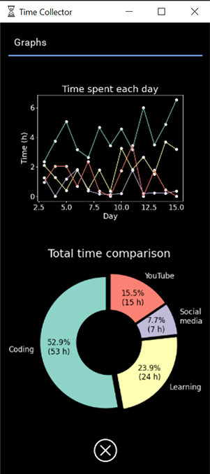

# TimeCollector is a time tracker app that allows you to monitor time spent on different activities, enhanced with the powerful visual graphs to illustrate the trends.

It helps you to be more aware of how you spend your time and manage it more efficiently.

TimeCollector allows you to:
  
1. Create separate trackers to add your activities once you start doing something.
2. Use the graphs to see trends in time spent on each activity.
3. Monitor how you spend your time and be proud of your productivity.
4. Take control of your time spending habits.
5. Export your data to Excel for advanced insights.

 

